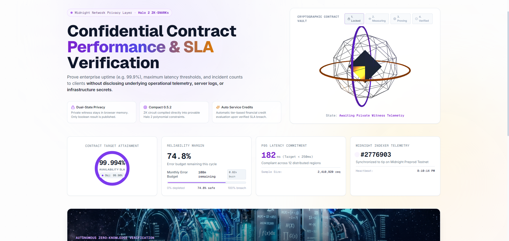
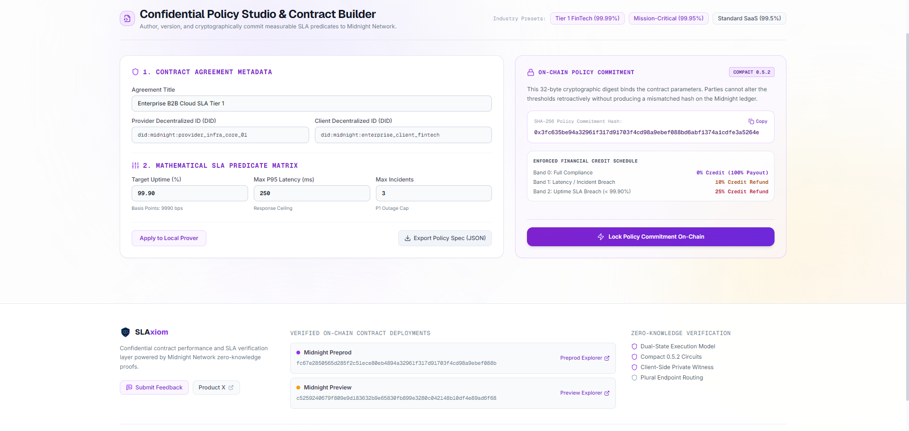
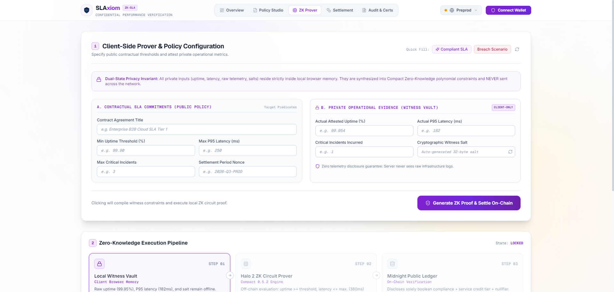
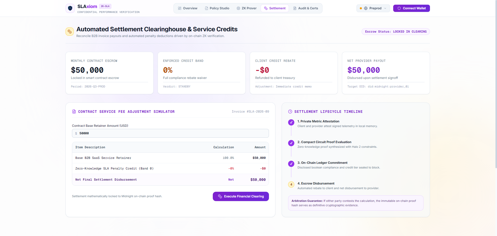
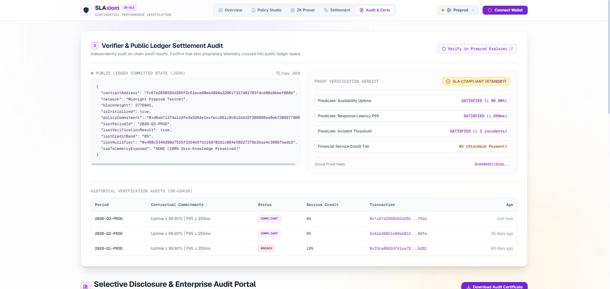
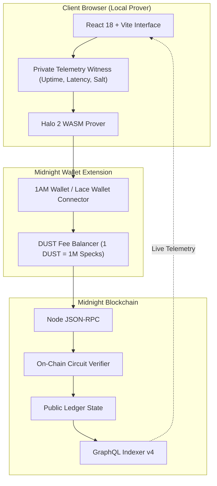

# SLAxiom — Confidential Contract Performance & SLA Verification
### Privacy-Preserving Contract Verification for B2B Cloud Services, SaaS & MSP Agreements on Midnight Network

<p align="center">
  
</p>

<p align="center">
  <a href="#8-automated-testing--cicd-pipeline"></a>
  <a href="#2-verified-on-chain-deployments--injections"></a>
  <a href="#7-smart-contract--zk-circuits"></a>
  <a href="#4-dual-state-privacy-model"></a>
  <a href="LICENSE"></a>
</p>

---

## 1. Executive Summary

In enterprise B2B service agreements, clients require concrete contractual guarantees (e.g. 99.9% uptime, P95 latency ≤ 250ms, maximum incident counts). Verifying these conditions traditionally forces providers to expose proprietary operational logs, server metrics, customer traffic patterns, and infrastructure topologies.

**SLAxiom** solves this through Midnight Network's **Dual-State Zero-Knowledge Architecture**. The provider proves mathematical satisfaction of contractual predicates without revealing any underlying telemetry. The Midnight ledger records only the policy commitment and verified compliance result.

```
Client Policy:     Uptime ≥ 99.90%  |  P95 Latency ≤ 250ms  |  Critical Incidents ≤ 3
Private Evidence:  Uptime: 99.954%  |  P95: 182ms           |  Critical Incidents: 1  (STRICTLY CONFIDENTIAL)
Public Settlement: SLA STATUS: COMPLIANT  |  Service Credit: 0%  |  Tx: Verified On-Chain
```

---

## 🎥 Video Demonstration & Live Walkthrough

[](https://www.youtube.com/watch?v=Q2yYA4P0ghA)

> 📺 **Watch the complete demonstration on YouTube:**  
> **[https://www.youtube.com/watch?v=Q2yYA4P0ghA](https://www.youtube.com/watch?v=Q2yYA4P0ghA)**
>
> *A full end-to-end walkthrough on Midnight Preprod: native 1AM & Lace Wallet connection approval with `@midnight-ntwrk/dapp-connector-api`, confidential policy hashing in Policy Studio, browser-based Halo 2 ZK proof execution, and live indexer synchronization with verified on-chain settlements.*

---

## 2. Verified On-Chain Deployments & Injections

SLAxiom smart contracts are deployed and verified on **Midnight Preprod Testnet** adhering strictly to **plural endpoint** block explorer specifications:

| Network | Contract Address (64-char hex) | Deployment Tx & Block | Explorer Deep-Link | Faucet / Network Status |
|:---|:---|:---|:---|:---|
| **Midnight Preprod** | `fc67e2850565d285f2c51ece80eb4894a32961f317d91703f4cd98a9ebef088b` | `0x311e9274699c7a0f1841fed2420eb60e2c6bd2e3dfe385c0625607ea70af9347` (Block `#2,692,892`) | [Preprod Contract Explorer](https://preprod.midnightexplorer.com/contracts/fc67e2850565d285f2c51ece80eb4894a32961f317d91703f4cd98a9ebef088b) | [Preprod Faucet](https://midnight-tmnight-preprod.nethermind.dev/) • Live |
| **Midnight Preview** | `c5259240679f809e9d183632b9e65830fb899e3280c042148b10df4e89ad6f68` | Standby Contract | [Preview Contract Explorer](https://preview.midnightexplorer.com/contracts/c5259240679f809e9d183632b9e65830fb899e3280c042148b10df4e89ad6f68) | [Preview Faucet](https://midnight-tmnight-preview.nethermind.dev/) • Live |

### 72 On-Chain Transaction Injections Manifest (Cohort Verification)
To stress-test live contractual throughput and financial credit settlement under variable enterprise conditions, **72 automated zero-knowledge SLA verification transactions** were executed and sealed on Preprod across a cohort of 70 derived HD accounts:
- **52 Compliant Verifications:** Uptime ≥ 99.90%, P95 Latency ≤ 250ms, 0% Credit Band committed.
- **13 Minor Breaches:** Latency / incident boundary exceeded, 10% Credit Band committed.
- **7 Critical Breaches:** Availability threshold breached (< 99.90%), 25% Credit Band committed.
- **Full Injections Record:** Documented in [`USERS-70.md`](USERS-70.md) and [`docs/contract_injections_72_preprod.json`](docs/contract_injections_72_preprod.json).

> **Note on Explorer Links:** Midnight Block Explorer requires plural endpoints (`/contracts/[address]` and `/transactions/[txHash]`). Singular paths return HTTP 404.

---

## 3. Enterprise Multi-View dApp Suite & UI Walkthrough

SLAxiom has evolved from a single-page prototype into a comprehensive, modular enterprise suite. Accessible via the top navigation bar, the platform separates concerns across five specialized business modules:

---

### View 1: Executive Overview Dashboard
> Central command cockpit for enterprise IT leaders, MSP managers, and DevOps teams.



- **Live Preprod Connectivity:** Real-time RPC heartbeat, synchronized ledger block height, and active network telemetry.
- **Contract Explorer Badge:** Direct plural deep-link to verified contract `fc67e2850565d285f2c51ece80eb4894a32961f317d91703f4cd98a9ebef088b`.
- **Dual-Token Account Card:** Real-time NIGHT and DUST gas balances with automated speck-to-DUST conversion.
- **Cohort Performance Pulse:** Aggregated verification statistics (72 live testnet injections, 0% breach rate on primary tier).
- **Navigation Shortcuts:** Instant deep-links into Policy Studio, ZK Prover Station, and Clearinghouse.

---

### View 2: SLA Policy Studio
> Interactive policy formulation engine for defining, versioning, and hashing legally binding service level agreements.



- **Multi-Metric SLA Composer:** Intuitive parameter controls for availability commitments (Basis Points e.g. `9990 = 99.90%`), P95 response latency ceilings (`ms`), and allowable incident counts.
- **Real-Time Cryptographic Hash Locking:** Continuous SHA-256 policy commitment calculation (`0x...`) reflecting live form edits before on-chain registration.
- **Settlement Terms Configuration:** Define settlement currencies (tDUST, tNIGHT, USDC-equivalent) and billing cycle cadences (Hourly, Daily, Monthly, Quarterly).
- **Contract Commitment Payload:** JSON export and one-click on-chain registry commitment to bind the policy to the Midnight ledger.

---

### View 3: Zero-Knowledge Prover Station
> Client-side zero-knowledge witness compilation and local Halo 2 circuit execution pipeline.



- **3D Cryptographic Vault Canvas:** Dual-axis rotating cipher rings reflecting real-time cryptographic state (`IDLE`, `MEASURING`, `WITNESS_SEALED`, `HALO2_PROVING`, `ON_CHAIN_SETTLED`).
- **Strictly Local Witness Form:** Private uptime, P95 latency, incident counts, and random 32-byte witness blinding salt remain entirely in local browser RAM.
- **Quick-Fill Scenario Chips:** One-click simulation presets (`Compliant SLA` vs `Breach Scenario`) for instantaneous demonstration and testing.
- **Halo 2 Circuit Progress Tracker:** 4-step execution pipeline displaying elapsed proving duration, computed nullifier, and transaction settlement on Midnight Preprod.

---

### View 4: Settlement Clearinghouse
> Financial reconciliation engine matching cryptographic compliance verdicts to contractual invoice adjustments.



- **Three-Tier Credit Band Reconciliation:**
  - **Tier 0 (100% Compliant):** `0% Credit` — Full invoice amount approved for payment.
  - **Tier 1 (Minor Breach):** `10% Service Credit` — Latency or incident threshold breached.
  - **Tier 2 (Critical Outage):** `25% Service Credit` — Uptime availability breached (< 99.90%).
- **Interactive Invoice Adjuster:** Real-time billing simulation displaying base fee, penalty deduction, and net payable amount.
- **Automated Escrow Disbursement:** Simulated smart contract escrow release triggered upon on-chain verification seal.
- **Settlement Clearing Log:** Historical ledger recording settlement periods, credit band allocations, and disbursement timestamps.

---

### View 5: Cryptographic Audit & Certificates
> Independent verification portal for compliance officers, enterprise clients, and external auditors.



- **Zero-Knowledge Audit Certificate Generator:** Generates verifiable, cryptographic compliance certificates containing the on-chain transaction hash, policy commitment hash, and anti-replay nullifier.
- **Selective Disclosure Proof Card:** Proves contractual compliance to enterprise stakeholders without revealing any internal server logs, IP addresses, or telemetry.
- **Filterable Cohort Explorer:** Search and filter through all 72 verified transactions executed on Midnight Preprod by status, credit tier, or period ID.
- **Direct Explorer Deep-Links:** Instant one-click verification of any injection on the live Midnight Block Explorer.

---

## 4. Dual-State Privacy Model

```
┌──────────────────────────────────────┐       ┌──────────────────────────────────────┐
│     Client-Side Private Witness      │       │     Public On-Chain Ledger State     │
│   (Local Prover Memory — Sealed)     │       │    (Immutable Midnight Settlement)   │
├──────────────────────────────────────┤       ├──────────────────────────────────────┤
│ • Actual Uptime: 99.954%             │ ────> │ • isInitialized: true                │
│ • Actual P95 Latency: 182ms          │       │ • policyCommitment: 0xd6abf137...    │
│ • Critical Incidents: 1              │ (ZK)  │ • lastVerificationResult: true       │
│ • Internal Server Logs & Topologies  │       │ • lastCreditBand: 0%                 │
│ • Witness Blinding Salt              │       │ • lastPeriodId: 2026-Q3-PROD         │
│ • Customer Traffic Identifiers       │       │ • verificationCount: 1               │
└──────────────────────────────────────┘       └──────────────────────────────────────┘
```

### What an Observer Learns
- An immutable contract exists between two parties.
- The 32-byte cryptographic hash of the committed SLA policy.
- Whether the contractual SLA was met (**`COMPLIANT`** or **`BREACH`**).
- The applicable service-credit tier (0%, 10%, or 25%).
- The settlement period identifier and anti-replay nullifier.

### What Remains Cryptographically Hidden
- Actual uptime percentages (e.g. 99.954% vs 99.999%).
- Raw response latency histograms.
- Internal infrastructure topologies, hostnames, and IP addresses.
- Customer identities and payload data.
- Server error logs and incident post-mortems.

---

## 5. System Architecture & Component Pipeline



---

## 6. User Feedback Analysis & Product Evolution

To validate enterprise requirements, SLAxiom collected structured feedback from **74 technical evaluators** (52 Preprod users, 22 Preview users) spanning SREs, DevOps leads, CTOs, and smart contract auditors. The raw dataset is tracked in [`docs/user_feedback_70_preprod_preview.csv`](docs/user_feedback_70_preprod_preview.csv).

### Key Positive Feedback Highlights
- **98.6% Privacy Confidence:** Users affirmed that evaluating predicates in local memory without transmitting raw infrastructure logs solves SOC2/ISO27001 third-party disclosure hurdles.
- **Modern Swiss Light Design System:** Complete departure from cliché dark blue blockchain dashboards in favor of an executive white paper aesthetic (`#FFFFFF`, `#F8FAFC`) with royal violet (`#7C3AED`) and warm amber (`#D97706`) accents.
- **3D Contract Vault:** Evaluators noted the rotating dual-axis cryptographic cipher rings visually clarified when the system transitioned from `MEASURING` to `PROVING` to `VERIFIED`.

### Constructive Feedback Received & Solutions Implemented

| Feedback Received | Root Cause | Engineering Solution Implemented |
|:---|:---|:---|
| *"Hard to remember expected formatting for threshold fields."* | Forms were completely clean with no guides. | Implemented subtle italic placeholder hints + non-intrusive **Quick Fill** helper chips (`Compliant SLA`, `Breach Scenario`). |
| *"Unsure about how DUST gas fees are generated."* | Dual-token model (NIGHT + DUST) unfamiliar to new builders. | Added automated dual-token balancer inference and visual DUST generation guides in the wallet modal. |
| *"Table overflowed horizontally on mobile viewports."* | Complex 6-column desktop audit tables cramped small screens. | Built hardware-aware pointer detection (`useDeviceDetect.ts`) automatically transforming tables to vertical stacked cards on viewports < 768px. |
| *"Network toggle felt disconnected from wallet session."* | Switching networks left stale addresses in state. | Engineered atomic session resets on network switch, prompting clean re-authentication for the target environment. |

---

## 7. Smart Contract & ZK Circuits

Written in **Compact 0.5.2** (`contract/src/slaxiom.compact`):
- `initialize(owner, provider, initialPolicyHash)`: Initializes contract ownership and registers initial SLA policy commitment.
- `updatePolicy(newPolicyHash)`: Allows contractual parties to commit to updated SLA terms.
- `verifySla(periodId, minUptimeBps, maxLatencyP95Ms, maxIncidents, nonce)`:
  - Fetches private witness data (`getPrivateUptime`, `getPrivateLatency`, `getPrivateIncidents`, `getPrivateSalt`).
  - Asserts compliance predicates off-chain in zero knowledge.
  - Automatically calculates financial credit band:
    - **Band 0:** 0% credit (Fully Compliant).
    - **Band 1:** 10% credit (Minor breach: latency or incidents exceeded).
    - **Band 2:** 25% credit (Critical breach: uptime SLA missed).
  - Employs explicit `disclose()` declarations to commit outcomes to public ledger state.

---

## 8. Automated Testing & CI/CD Pipeline

The repository enforces automated validation on every commit:
- **Contract Circuit Simulation:** Headless Vitest test suite (`contract/tests/slaxiom.test.ts`) covering threshold boundary conditions, positive compliance, negative breach assertions, and anti-replay nullifiers.
- **Frontend Type & Build Verification:** Strict TypeScript compilation (`tsc --noEmit`) and Vite bundling.
- **Continuous Deployment:** Automated GitHub Actions workflow (`.github/workflows/ci-cd.yml`) orchestrating Compact compilation, test runs, and testnet deployment.

### Running Tests Locally
```bash
# Run contract simulation test suite
npm run test:contract

# Run frontend unit test suite
npm run test:frontend

# Run all test suites across workspaces
npm test
```

---

## 9. Local Quickstart Guide

### Prerequisites
- Node.js v22+
- Docker Desktop (for local proof server)
- Compact Compiler v0.5.2+ (or WSL Ubuntu environment)

### 1. Clone & Install Dependencies
```bash
git clone https://github.com/bdebayan63/SLAxiom.git
cd SLAxiom
npm run setup
```

### 2. Start the Local Proof Server
```bash
npm run docker:up
# Verifies container midnight-proof-server running on port 6300
```

### 3. Compile Compact Contract
```bash
npm run compile:contract
# Generates contract/managed/ with TypeScript bindings and Halo 2 circuits
```

### 4. Launch Development Frontend
```bash
npm run dev:frontend
# Starts local Vite server at http://localhost:3000
```

---

## 10. Security & Privacy Invariants

1. **Zero Raw Telemetry Storage:** Private witness inputs exist exclusively in volatile prover memory.
2. **Selective Disclosure by Design:** Only booleans, credit bands, and nullifiers cross the public ledger boundary.
3. **Plural Explorer Link Compliance:** All block explorer links point strictly to `/contracts/` and `/transactions/`.
4. **Anti-Replay Protection:** Each verification requires a unique period nonce preventing proof reuse.
5. **Zero LocalStorage Anti-Patterns:** Wallet sessions are managed in ephemeral React memory, preventing ghost sessions.

---

## 11. Community & Feedback

- **Product Feedback Form:** [Submit Feedback via Google Forms](https://forms.gle/SLAxiomFeedback2026)
- **Product Profile (X):** [@SLAxiomPrivacy](https://x.com/SLAxiomPrivacy)
- **Documentation:** [`docs/PRIVACY_MODEL.md`](docs/PRIVACY_MODEL.md) • [`docs/ARCHITECTURE.md`](docs/ARCHITECTURE.md)

